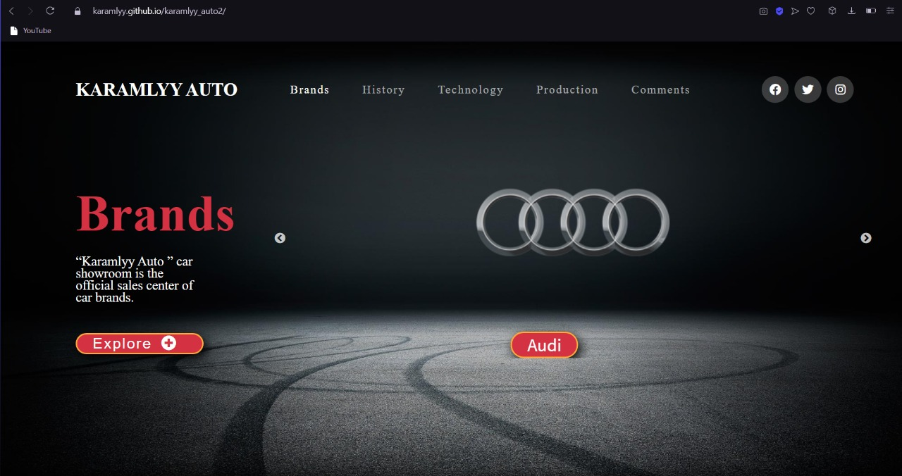
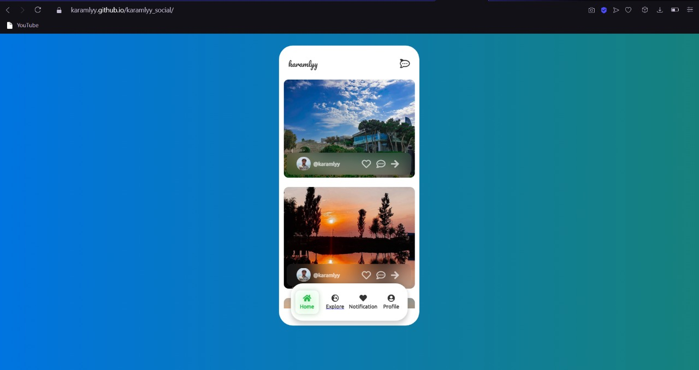
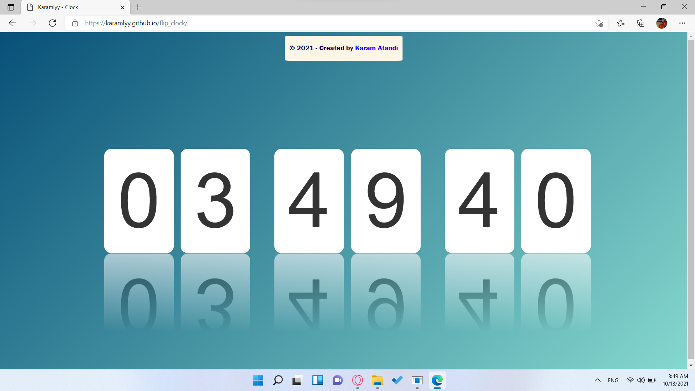
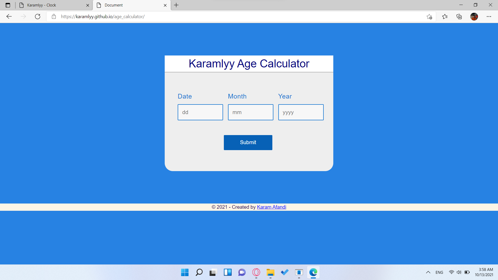

<!DOCTYPE html>
<!DOCTYPE html>
<html lang="en">
  <head>
    <meta charset="UTF-8" />
    <link rel="shortcut icon" href="ico.jpg" />
    <meta http-equiv="X-UA-Compatible" content="IE=edge" />
    <meta name="viewport" content="width=device-width, initial-scale=1.0" />
    <link
      href="https://unpkg.com/boxicons@2.0.9/css/boxicons.min.css"
      rel="stylesheet"
    />
    <link rel="stylesheet" href="main.css" />
    <title>Karam Afandi</title>
  </head>
  <body class="hidden">
    

      <h2>Karam Afandi</h2>
      
Page is loading, please wait.

    

    <nav>
      

        <h1 class="logo">Karam Afandi</h1>
        <ul>
          <li><a href="#home" class="link-active">Home</a></li>
          <li><a href="#about">About</a></li>
          <li><a href="#portfolio">Portfolio</a></li>
        </ul>
        

          

          

          

        

      

    </nav>
    <section id="home">
      

        

          <h2>Hi! I am Karam.</h2>
          

            <a href="mailto:karam_afandi@yahoo.com" target="_blank"
              ><i class="bx bx-envelope"></i
            ></a>
            <a href="https://www.instagram.com/karamlyy/" target="_blank"
              ><i class="bx bxl-instagram"></i
            ></a>
            <a href="https://www.facebook.com/karamlyy/" target="_blank"
              ><i class="bx bxl-facebook"></i
            ></a>
            <a href="https://github.com/karamlyy" target="_blank"
              ><i class="bx bxl-github"></i
            ></a>
          

        

      

    </section>
    <section id="about">
      

        <h3 class="header-3">About me</h3>
        

            I am Karam Afandi. I am 19 years old. I started web programming in 2019. 
            Although programming seemed difficult to me at first, I worked on myself 
            and overcame the difficulties. My biggest goal is to work as a web 
            developer at Rockstar. I think I will achieve my goal.You too will strive
            to achieve your goals, and in the end you will definitely achieve what you want. 
        

      

    </section>
    <section id="portfolio">
      

        <h3 class="header-3">Portfolio</h3>
        
Knowledge

        

          

            <h5>HTML</h5>
            

          

          

            <h5>CSS</h5>
            

          

          

            <h5>Bootstrap</h5>
            

          

          

            <h5>JavaScript</h5>
            

          

          

            <h5>JQuery</h5>
            

          

          

            <h5>React</h5>
            

          

        

        
Last Projects

        

          

            
            <a href="https://karamlyy.github.io/restaurant/"
              >Karamlyy Restaurant</a>
          

          

            
            <a href="https://karamlyy.github.io/quiz_app/"
              >Karamlyy Quiz App</a>
          

          

            
            <a href="https://karamlyy.github.io/karamlyy_auto2/">Karamlyy Auto</a>
          

          

            
            <a href="https://karamlyy.github.io/karamlyy_social/">Karamlyy Social Media</a>
          

          

            
            <a href="https://karamlyy.github.io/flip_clock/"
              >Karamlyy Flip Clock</a>
          

          

            
            <a href="https://karamlyy.github.io/age_calculator/"
              >Karamlyy Age Calculator</a>
          

        

      

    </section>
    <footer>
      
&copy; 2021 - Designed by  <a href="https://karamlyy.github.io/profile/" target="_blank">Karam Afandi</a>

    </footer>
    <canvas class="webgl"></canvas>
    
    
    
    
    
  </body>
</html>

